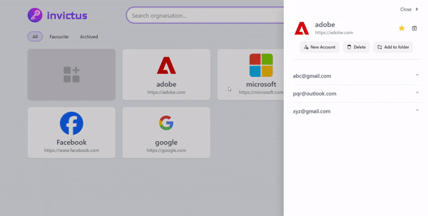

# Invictus - Secure Password Manager CLI

<p align="center">
  
</p>

**Invictus** is a powerful and easy-to-use CLI tool built with Node.js for securely managing passwords. It securely stores your passwords in the OS keychain using the **keytar** library and provides an intuitive web interface for managing passwords with a beautiful, responsive UI.

## 🚀 Installation

To install **Invictus**, run the following command:

```sh
npm install -g invictus
```

## 🛠 Usage

Once installed, you can use the `invictus` command to manage your passwords.

### 📜 Available Commands

#### 1. Show Stored Passwords

```sh
invictus show [title]
```

**Usages**
- can be used to list all the accounts within a specific organisation
- Can be used to list all the organisations (not the accounts withing them)
- Can be used to list all favourite organisations (not the accounts within them)
- Can be used to list all archived organisations (not the accounts within them)

**Positional Arguments:**

| Name  | Required |Description                                                                     |
| ----- | -------- | ------------------------------------------------------------------------------- |
| title | false    | The title of the organization/website. If not specified, CLI prompts for input. |

**Aditional Options**
- `--orgs` or `-o` specifies whether to show only organisations not account within them. If not specified then all accounts of a choose organisation is shown.
- `--fav` or `-f` specifies whether to show favourite organisations. Cannot be used without specifying `--orgs` flag 
- `--archived` or `-a` specifies whether to show archived, Cannot be used without specifying `--orgs` flag


#### 2. Add a New Password

```sh
invictus add [title] [email] [des]
```

Adds a new password entry securely.

**Positional Arguments:**

| Name  | Required |Description|
| -------- | ---------- | ------------------------------------------------------------------------------- |
| title | false    | The title of the organization/website. If not specified, CLI prompts for input. |
| email | false    | The email or username for the account. If not specified, CLI prompts for input. |
| des   | false    | An optional description of the account.                                         |

#### 3. Delete a Password

```sh
invictus delete [title] [email]
```

Deletes a stored password.

**Positional Arguments:**

| Name  | Required | Description |
| ----- | -------- |------------------------------------------------------------------------------- | 
| title | false    | The title of the organization/website. If not specified, CLI prompts for input. |
| email | false    | Your account's email/username. If not specified, CLI prompts for input.         |

#### 4. Update a Password

```sh
invictus update [title] [email]
```

Allows you to update an existing stored password.

**Positional Arguments:**

| Name  | Required |Description                                                                     |
| ----- | -------- |------------------------------------------------------------------------------- |
| title | false    | The title of the organization/website. If not specified, CLI prompts for input. |
| email | false    | Your account's email/username. If not specified, CLI prompts for input.         |

#### 5. Copy a Password to Clipboard

```sh
invictus copy [title] [email]
```

Copies a stored password to your clipboard for easy pasting.

**Positional Arguments:**

| Name  | Required |Description |
| ----- | -------- |------------------------------------------------------------------------------- |
| title | false    | The title of the organization/website. If not specified, CLI prompts for input. |
| email | false    | Your account's email/username. If not specified, CLI prompts for input.         |

#### 6. Access the Web App

```sh
invictus web
```

Starts the Node.js server and opens the web-based password manager.

<p align="center">
  
</p>


#### 7. Generate a Secure Password

```sh
invictus generate
```

Generates a strong password. Additional options:

- `--length` or `-l` → Specify the password length (default: 16 characters).
- `--save` or `-s` → Copy the generated password to clipboard.


#### 8. Toggle favourite status of a organisation

```sh
invictus fav
```
Toggle favourite status of an organisation i.e. if it is a favourite then it wil
l be removed from favourites and vice versa

**Positional Arguments**

| Name  | Required | Description | 
| ----- | -------- | ------------------------------------------------------------------------------- |
| title | false    | The title of the organization/website. If not specified, CLI prompts for input. |

#### 9. Toggle archived status of a organisation

```sh
invictus archive
```
Toggle archived status of an organisation i.e. if it is a archived then it wil
l be removed from archived and vice versa

**Positional Arguments**

| Name  | Required | Description | 
| ----- | -------- | ------------------------------------------------------------------------------- | 
| title | false    | The title of the organization/website. If not specified, CLI prompts for input. |

#### 10. Display Help or Version

```sh
invictus --help
invictus --version
```

Displays usage instructions or the current version of Invictus.

## 🔑 Key Features

- 🔐 **Secure Storage**: Uses **keytar** to securely store passwords in your OS keychain.
- 🖥 **Web UI**: Comes with a beautifully designed web app accessible via `invictus web`.
- 📝 **Easy Management**: Add, delete, update, or copy passwords with simple CLI commands.
- 🛡 **Secure Generation**: Create strong passwords with the `generate` command.

## 📦 Dependencies

Invictus relies on the following libraries:

- **chalk** - CLI text styling
- **clipboardy** - Clipboard access
- **cors** - Cross-origin support for the web app
- **crypto-js** - Encryption for password security
- **dotenv** - Environment variable management
- **express** - Web server for the web app
- **keytar** - Secure password storage in OS keychain
- **open** - Opens the web UI in a browser
- **prompts** - Interactive CLI prompts
- **yargs** - Command-line argument parsing

## 📜 License

This project is licensed under the **MIT License**.

## 📩 Reporting Issues

For any issues, please open a ticket on GitHub:
🔗 [GitHub Issues](https://github.com/kanhaiyadav/invictus)\
Or email me at 📧 **[kanhaiyadav.me@gmail.com](mailto:kanhaiyadav.me@gmail.com)**.

---

Enjoy using **Invictus** and keep your passwords secure! 🔒

